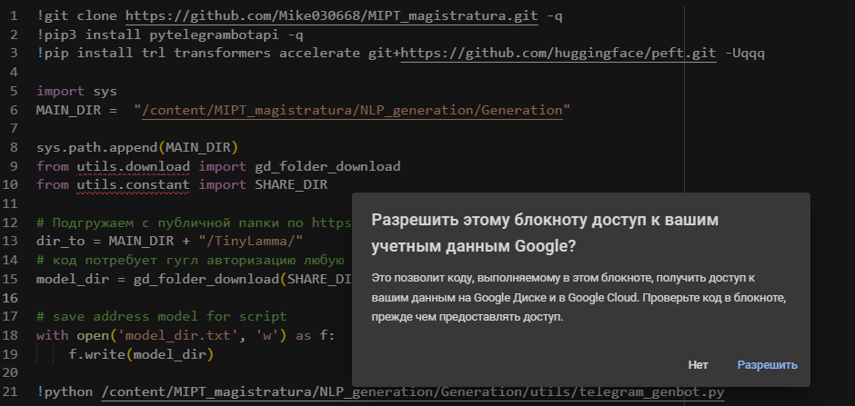

# Project_generativ_bot
 MIPT_education solution home_task:

Used trained TyniLLama

- simple test of context retrevial bot possibly in [colab_notebook](https://github.com/Mike030668/MIPT_magistratura/blob/main/NLP_generation/Project_retrivial_bot/Context_talk_test.ipynb)

- telegramm inference [colab_notebook](https://github.com/Mike030668/MIPT_magistratura/blob/main/NLP_generation/Project_retrivial_bot/Telegram_inference.ipynb)  and try **https://t.me/SouthPark_test_bot** bot

For load model will  need to accses requirings and use your gooogle accaunt to permission

Process of loading is arounr 3 minuts, after can start in telegram 

