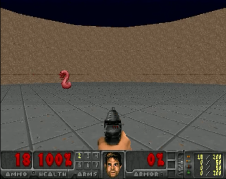
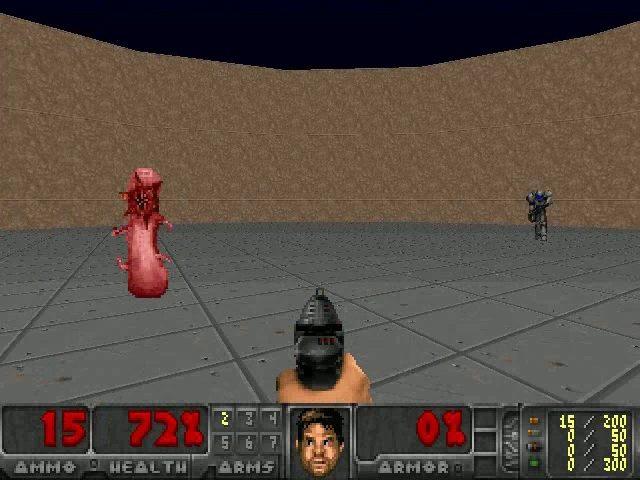
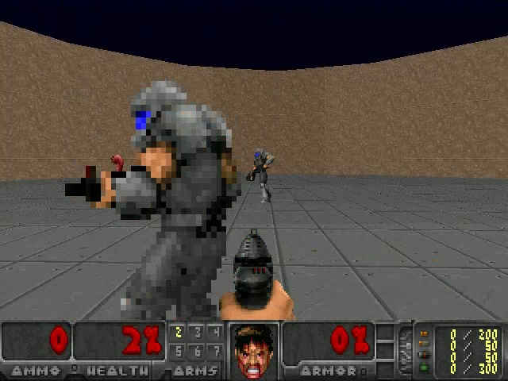
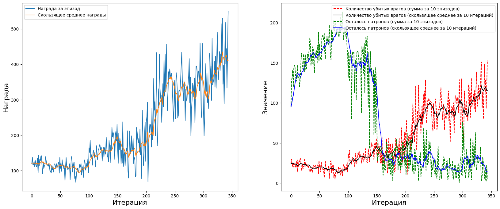
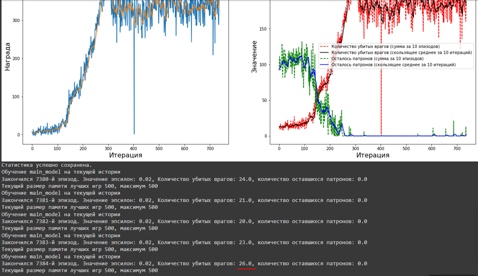

# Реализации DDQN с дополнительной памятью BEST действий

*Данная реализация из 2х видов памяти позволяет использывать небольшой их раз мер в сумме, от стандартной реализации для подобных задач*

реализовано на игре VIZDOOM https://github.com/Farama-Foundation/ViZDoom

документация - https://vizdoom.farama.org/introduction/pythonQuickstart/

    

## особенности:
- используется временная модель для анализа последовательного набора кадров (тут на 9 кадров).
- для этого изменен алгоритм сбора последовательных кадров, с частотой которую задаем (тут через 4 кадра).
- от среды мы имеем ответ в виде:
    *   ammo остаток патрон;
    *   player’s health текущее здоровье;
    *   reward:
        *  +1 for killing a monster
        *  -1 for death
        *  0 nothing
- мы можем управлять - лево, право и стрелять. Всего 26 патронов и 100 очков здоровья. Нас атакуют монстры вблизи и стреляют пришельцы. Урон разный и это отражается в остатке здоровья.
- к базовому вознаграждению сделана функция get_reward, котрая доет добавки в зависимости сколько мы в игре, как изменилось здоровье (нас атакуют разные и урон разный), стреляли ли ...:

                # Если кадр является последним в игре, ставим награду как -0.1 и возвращаем её (агент умер)
                if episode_done:
                    reward = -0.5 * previous_info[3]/(current_info[3] + psi)
                    return reward

                # Если убили врага в кадре, увеличиваем награду на 1
                if current_info[0] > previous_info[0]:
                    reward += 1

                # Если потеряли здоровие, уменьшаем на соотношение разницы к прошлому
                if current_info[1] < previous_info[1]:
                    reward -= 0.3*(previous_info[1]-current_info[1])/(previous_info[1] + psi)

                # Если использовали патрон, уменьшаем награду на 0.1
                if current_info[2] < previous_info[2]:
                    reward -= 0.1

                # Если живы
                if current_info[3] > previous_info[3]:
                  reward += 0.1 * previous_info[3]/(current_info[3] + psi)

- кроме базового стека памяти организован стек приоретизированой памяти, куда отбираются лучшие фрагменты выше порога, который смещается по мере обучения на основе общего результата игры от среды

- отбор в стек лучших кадров(тут у нас 9 для сети) идет на основе рейтинга, на сколько улучшилось состояни (в стандартного плюс кастомный выигрыш/проигрыш) во фрагменте посде прошлого фрагмента.

- рейтинг учитывает, было ли действие случайое или от действия самой сети, что зависит от эпсилон, котрый постепенно снижается в обучении. Тем самым вес у случайного действия или осозаного разный и попадают в буфер случайные действия только с заведомо высоким рейтингом.

- после окончания игры, собранный steck_episode с игры, тех фрагментов, что улучшали состояние агента, могут быть добавлены в память лучших игр `best_games`. Порог сбора постепенно растет по мере повышения уровня игры агента, по оценке реворда

- если сумарный рейтинг всего стека превысил текущий порог, то обновляем целевую модель в этот момент, внепланово.

- как в стандартном обновляем целевую модель весами основной модели раз в заданное количество target_model_update_frequency шагов, но перед этим еще тренеруем на лучших фрагментах `best_games`.

________________________________
**Задача состоит в том как научится стрелять максимально метко**

## Текущее состояние сети уже может выдавать поражение 20-22 противников и способно учиться далее.

   
________________________________

### Данная структура обучения, позволяла добиваться ранее работы агента на максимуме и без просадок

