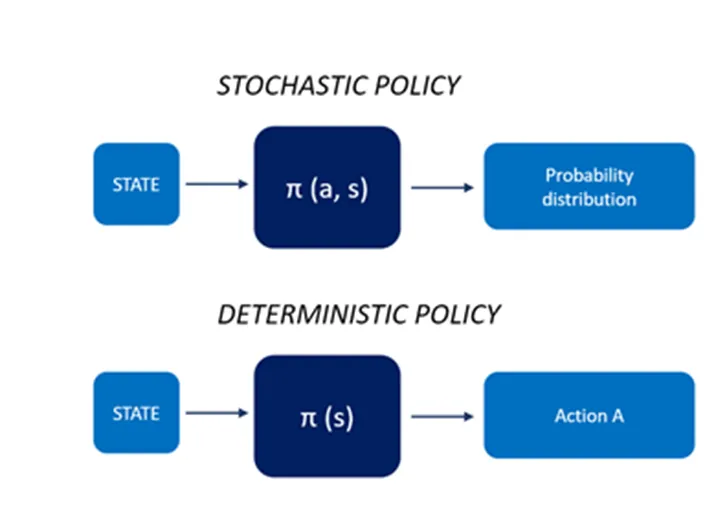
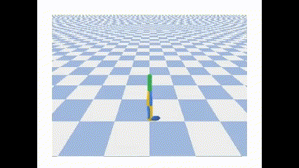
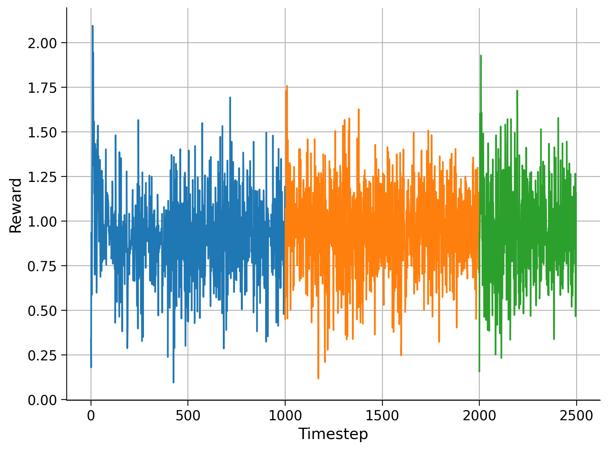

## Задача: обучить агента действовать в средах с непрерывным пространством действий, используя алгоритм SAC (Soft Actor Critic) или PPO (Proximal Policy Optimization).

_________________________

### Для задания был исполmзован фреймворк *`google-deepmind-acme`*, который позволил провести тесты и обучение на CPU в среде `pybullet-gym` - `Walker2DBulletEnv`

- В данном [ноутбуке](https://github.com/Mike030668/MIPT_magistratura/blob/main/RL/DZ_3/DZ_3_pybullet_tests.ipynb) были проведены тесты соеды и подбор вариантов управления агентом на основе формул
  
     

тесты показали, что можно привестив движение объект путем подбора функций и парамметров
_________________________

      

`DDPG`, являющийся методом актера-критика, состоит из двух моделей: актера и критика, в отличаи от DQN модели, предсказывающей только распределение

ACTOR — это сеть политик, которая принимает состояние в качестве входных данных и выводит точное действие (непрерывное), а не распределение вероятностей по действиям, таким как `DQN`.

1. Алгоритмы обучения вне политики оценивают и улучшают политику, которая отличается от политики, которая используется для выбора действия. Тоесть, **[Целевая политика  !=  Политика поведения]**.

2. Целевая политика `pi(a|s)`: Это политика, которую агент пытается изучить, т.е. агент изучает функцию значения для этой политики.

3. Политика поведения `b(a|s)`: Это политика, которая используется агентом для выбора действия, т.е. агент следует этой политике для взаимодействия с окружающей средой.

## проведено обучение агента DDPG в [ноутбуке](https://github.com/Mike030668/MIPT_magistratura/blob/main/RL/DZ_3/DZ_3_pybullet_DDPG.ipynb)

   

- далее проведено обучение агента DMPO в [ноутбуке](https://github.com/Mike030668/MIPT_magistratura/blob/main/RL/DZ_3/DZ_3_pybullet_DMPO.ipynb)
  
**Distributional Maximum a posteriori Policy Optimization (DMPO)**

Максимальная апостериорная оптимизация политики:
    MPO — это KL-регуляризованный алгоритм обучения с подкреплением для задач непрерывного управления. Цель включает поочередное максимизацию Q-функции и оптимизацию политики p.
    MPO работает в рамках концепции максимизации ожиданий. Не отностится к семейству SAC . Взят для сравнения

 

  
