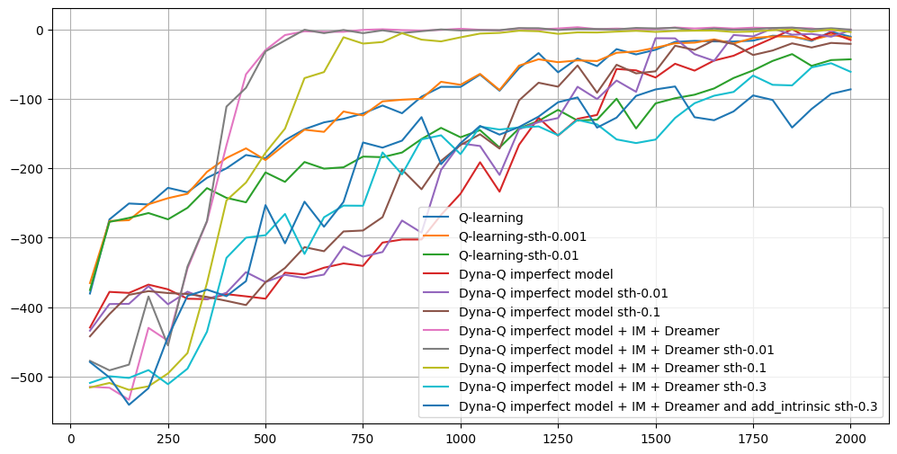
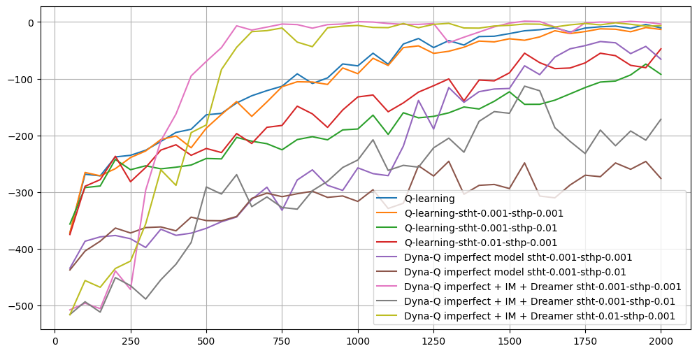

# Обучение с подкреплением с использованием модели мира

- Описание. Детерминированная среда:

    Реализовать табличный алгоритм Dyna на основе среды из первого задания.
    Протестировать Dyna с различным количеством шагов планирования начиная с 0 (которое соответствует обычному Q-обучению).
    Сравнить результаты в виде графиков суммарного вознаграждения и времени обучения для каждого значения шагов планирования.
    Стохастическая среда:

- Модифицировать среду, чтобы она стала стохастической, удостоверившись, что нескольких состояний существует как минимум два состояния с ненулевой вероятностью перехода.

- Адаптировать алгоритм Dyna для учета стохастичности среды.

- Предоставить аналогичные графики, как и в первой части задания.

_________________________________________________________________

# РЕШЕНИЕ
Для решения данной задачи:
- на фреймворке `GYM` в среде `TAXI-v3` был взят врапер `TaxiMDPWrapper` из задачи 1 и доработан для работы с `GYM` и алгоритмом `Dyna-Q` из лекции `Model-based RL`
- так же во врапер `TaxiMDPWrapper` добавлены методы `encode` и `decode` , которые не работают в `GYM` 

- были внесени доработки в механизм обучения для придания стахостичности самой среде с использыванием  методов `encode` и `decode`

- в [ноутбуке](https://github.com/Mike030668/MIPT_magistratura/blob/main/RL/DZ_4/DZ_4_1.ipynb) вносится стохастичность от значения аргумента stoch, от его знаяения завист будет или нет смещение положения такси (вправа и/или вверх) уже после шага на основе политики.

- в [ноутбуке](https://github.com/Mike030668/MIPT_magistratura/blob/main/RL/DZ_4/DZ_4_2.ipynb) добавлена дополнительно и стохастичность в положение пассажира и его цели. От значения аргумента `stoch_p` завист будет или нет смещение положения пассажира  (вниз) и/или его цели (вниз) уже после шага такси на основе политики. И оставлена стахостичность и для такси в аргументе `stoch_t`, от его знаяения завист будет или нет смещение положения такси (вправа и/или вверх) уже после шага на основе политики.

В ноутбуках проведены эксперементы как `Q` алгоритмом, так и с вариантами `Dyna-Q` , включая `Dreamer` (когда все дополнительные изучения среды производятся только в виртуальной(вображаемой) среде.

## Стахостичность только такси:

 

Наиболее стабилин в обучении, как без стохастики среды, так и при стохастике это `DynaQDreamerAgent`так как внутри алгоритма для обучения присутствуют стохастические шаги , котрае отчасти иммитируют стохастичность самой среды до определенного уровня. Видно, что при стохастичности 0.3, или 30%б алгоритм сильно проседает уже.

## Стахостичность такси и пассажира с его целью:

 

К сожаления, поздно обнаружил лишние нули в описании к графиком, там везде нуль лишний, так как эксперементы проводились не по всем методам, но стемиже, что и на графике выше. 

`DynaQDreamerAgent` вполне устоичив и при добавлении стохастики в пасажиру и его цель. Но влияние стохастики пассажира значительно выше чем от стохастики самого такси. Связано это с тем, что конечные точки траекторий в алгоритме Q обучения имеют боьшее влияние при учете 'reword` в обучении.
