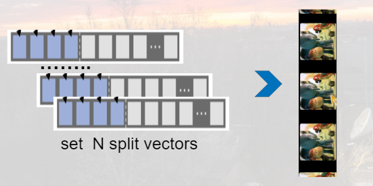

# Презентация исследований в подходе к задаче Text - 2 - Video

## Отправная точка - идея сплитера эмбедингов:
- [презентация](https://drive.google.com/file/d/1pAPhVM_eh3-WU_iY04GDMMV648D3NOhd/view?usp=sharing) идеи руководителю перед началом исследований

## Цель и задачи исследования:
### Цель 
- изучение и разработка методики и кода для генерации последовательных кадров из текста
### Задачи исследования:
- Ознакомление с принципами в основе диффузионных моделей
- Изучение представления текстового пространства
- Поиск методик влияния но текстовое пространство
- Анализ взаимосвязей и влияния изменений текстового пространство на генерацию изображения 
- Разработка принципов построения пайплайна /конвейера обучения - возможных моделей и методик их обучения
- Развитие концепции для построения цепочек применения различных методов и диффузионных моделей для перехода от короткого ролика к сюжетному мини фильму

## ГИПОТЕЗА
**Небольшие последовательные изменения текстового представления (эмбеддингов), могут привести к формированию малых изменений в генерируемых изображениях для формирования видеоряда.**

## МЕТОДЫ ИССЛЕДОВАНИЯ
<li> Влияние на эмбеддинг текста для генерация из измененных эмбеддингов посдедовательных изображений 
<li> Влияние на эмбеддинг текста и формирование из измененных эмбеддингов стартового шума для генерация из них последовательных изображений
<li> Сочетание обеих методик

## ОСНОВА
- Широко применяемый подход I-Frame, использует опорный кадр и последующие за ним кадры изменений, подталкивает к мысли, что нужно научиться передавать в модель информацию о движении в виде изменений - смещения!

- Анализ корреляций между изменениями соседних CLIP векторов и информации соседних кадров (пиксельной сумме) показывает четкую согласованность

- Применение вычисляемой матрицы переходов (вращений) на близких CLIP векторах, может теоретически дать аккуратное смещение текстового эмбединга, используемого для генерации, и получения близкого представления

      *R = I + (n_2 * n_1.T -  n_1 * n_2.T) *  sin(a) +  (n_1 * n_1.T +  n_2 * n_2.T) *  (cos(a) - 1)
       (https://math.stackexchange.com/questions/598750/finding-the-rotation-matrix-in-n-dimensions)

  
## ЭКСПЕРЕМЕНТЫ
<li>  Unet stable-diffusion-v1-4

  

