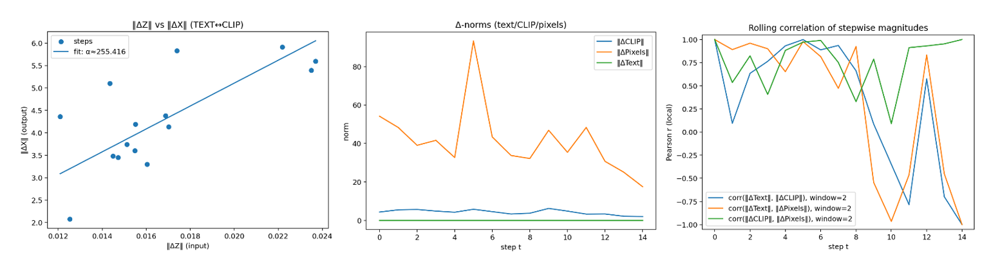
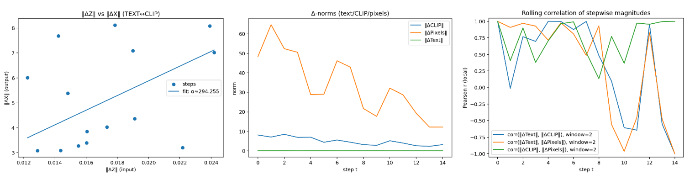
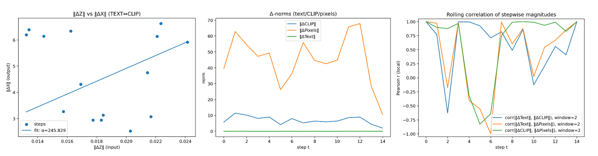

# Rotation-in-Embedding Experiments (Kandinsky 2.2)

Короткое резюме экспериментов из статьи: управление видеорядом **без дообучения модели**, через **малые ортогональные повороты** в пространстве текстовых эмбеддингов и (опционально) в стартовом шуме. Показываем перенос направлений из влияющего видеоряда в CLIP/EDGE/DEPTH и далее в пиксели.

## 1) Идея в одном абзаце

Мы берем влияющий видеоряд ({\hat{x}_t}) и по парам соседних кадров извлекаем визуальные эмбеддинги (CLIP), строим двумерную плоскость и малый поворот. Этот поворот применяем **к исходному текстовому эмбеддингу** (режим «якоря»: всегда относительно (\hat{x}_0)) с gain (g \in {0.1, 0.3}). Дополнительно можем поворачивать **стартовый шум** на основе EDGE/DEPTH-признаков влияющего ряда. Дальше обычная генерация (Kandinsky 2.2).

## 2) Наборы экспериментов

Четыре стандартизированных сценария:

* **A0 — rotate only**
  Малые повороты текста, без дрейфа латента/контуров/глубины.
  Параметры: `g ∈ {0.1, 0.3}`.

* **A1 — rotate + R-drift**
  Поворот текста + добавка к латенту по матрице поворота (малый коэффициент дрейфа).

* **B1 — + EDGE drift**
  Как A1, плюс поворот «краевых» (EDGE) признаков, извлеченных из разностей кадров (и из сгенерированных).

* **B2 — + DEPTH drift (EDGE_DEPTH)**
  Как A1, плюс поворот по глубине/контурам (MiDaS-глубина, затем EDGE/DEPTH-композиция).

Все сценарии прогонялись по **3 влияющим видео** (A–C) и **3 большим seed** (случайно выбраны в диапазоне ~10⁹–10¹²). Размер кадров: **512×512**.

## 3) Что фиксируем

* Модель: **Kandinsky 2.2**.
* Размер: **H=W=512**.
* Текстовый промпт: фиксированный (см. ноутбук).
* Влияющий видеоряд: ({\hat{x}_t}), срез по **16 кадрам** (по умолчанию).
* Режим «якоря»: поворот всегда относительно (\hat{x}_0).
* Seeds: `[SEED_1, SEED_2, SEED_3]` (см. лог/CSV).
* Кол-во шагов диффузии: `num_inference_steps = 35` (если не указано иное).

## 4) Что измеряем (метрики)

* **TEXT–CLIP:** косинус между соседними текстовыми эмбеддингами после поворота; корреляция модулей шагов.
* **IMG–CLIP:** косинусы между соседними CLIP-эмбеддингами для сгенерированных кадров.
* **EDGE/DEPTH:** косинусы/корреляции для векторов признаков (если включены).
* **Угол шага** между соседними ориентирами (для контроля величины изменения).
* **Согласованность**: корреляция «шагов» TEXT vs IMG-CLIP (показывает перенос направления).

## 5) Ключевые результаты (саммари)

* Малые повороты в тексте ((g=0.1…0.3)) дают **стабильную и монотонную** динамику в IMG-CLIP; корреляции шагов **положительны и значимы**.
* Добавки по EDGE/DEPTH (**B1/B2**) усиливают структурную согласованность (границы, формы), особенно при неизменном тексте.
* Слишком большой поворот (за пределами наших (g)) приводит к «семантическому вылету» — обсуждается в статье как ограничение.
* Режим «якоря» (всегда от (\hat{x}_0)) снижает дрейф и стабилизирует серию.

## 6) Иллюстрации (подставь свои файлы)

* TEXT–CLIP (сценарий A0, (g=0.3), усреднение по A–C, seed₁–seed₃):
  

* IMG–CLIP vs TEXT–CLIP (корреляция шагов, сводная по сценариям):
  

* Влияние EDGE/DEPTH (B1/B2):
  

*(Если нужны подписи как в статье — продублируй их под рисунками.)*

## 7) Репозиторий / структура артефактов

```
.
├─ notebook/                  # экспериментальный ноутбук
├─ results/
│  ├─ A0/ A1/ B1/ B2/         # сценарии
│  │  ├─ film_A/ film_B/ ...  # влияющие видео
│  │  │  ├─ seed_xxx/         # сиды
│  │  │  │  ├─ results.csv    # метрики по шагам
│  │  │  │  ├─ frames/*.png   # карточки/кадры (если сохранены)
│  │  │  │  └─ stats.json     # агрегаты (если сохранены)
├─ img/                       # финальные графики для README/статьи
└─ README.md
```

## 8) Быстрый старт (локально)

1. Установить зависимости (см. верх блока в ноутбуке).
2. Подготовить влияющие ряды (папка/список кадров).
3. В ноутбуке указать пути к ({\hat{x}_t}), выставь `SCENARIO`, `SEEDS`, `QTY_CADRS`.
4. Запустить `run_grid(experiment_matrix)` — логи и `results.csv` появятся в `results/...`.

## 9) Воспроизводимость

* Все сценарии описаны через флаги (`ROTE_TEXT`, `FORSE_R_matrix_DRIRT_LATENT`, `EDGE_LATENT_DRIFT`, `DEPTH_LATENT_DRIFT`, `NORN_LATENT`, `g` и т.д.).
* Seeds и размеры фиксируются в `cfg` и в имени папки.
* Для усреднений мы используем 3 видео × 3 seed (смотри `results/_exp_logs/results.csv`).

## 10) Ограничения и заметки

* Работает в допущении **локальной линейности**; при больших поворотах возможен «semantic drift».
* В базовой версии **нет временной памяти**; это контролируемая «анимация» через траекторию в эмбеддингах.
* EDGE/DEPTH встроены как **структурные подсказки**; качество зависит от качества глубины/контуров.

## 11) Ссылки

* Статья (препринт/версия журнала): `на рецензии`
* [Репозиторий с экспериментами:](https://drive.google.com/drive/folders/1DxRwS3s8Z0wVvXtBrpvVz1KqKnqsM6B6?usp=sharing)
* [Ноутбук экспериментов:](./Pipe_exp_K22_text_rote_dreif_latent_cropsquare_depth_.ipynb)

